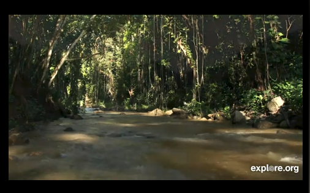
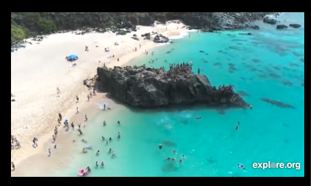

## MMM-WaimeaFalls-Live

* Live video and sound of WaimeaFalls (and surroundings) in Hawaii.

Relax with the water sounds of this live stream from Waimea Falls, on the island of 
Oahu of the U.S. state of Hawaii. This moving webcam shows you different live streams from 
the north side of the island including Waimea Falls, the sand beach and other lush areas,
along with serene stream sounds.

## Examples
The module is a live stream. These are still shots, obviously.

  

## Installation

* `git clone https://github.com/mykle1/MMM-WaimeaFalls-Live` into the `~/MagicMirror/modules` directory.

## Config.js entry and options

    {
    disabled: f,
    module: 'MMM-WaimeaFalls-Live',
    position: 'bottom right',
    config: {
        height:"270px",
        width:"480px",
        useHeader: false,                // true if you want a header
        header: "",                      // Change in config file. useHeader must be true
        animationSpeed: 1000,            // fade speed
    }
},

